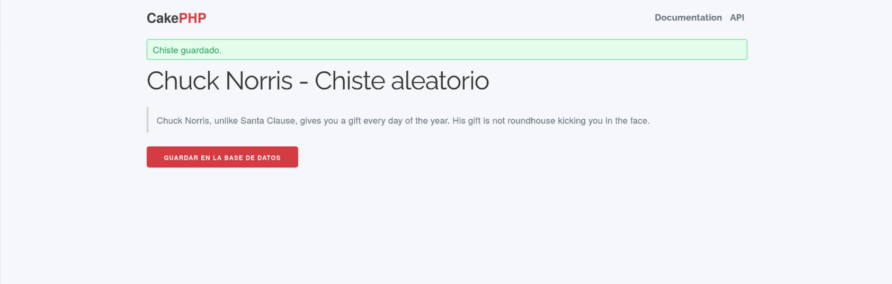
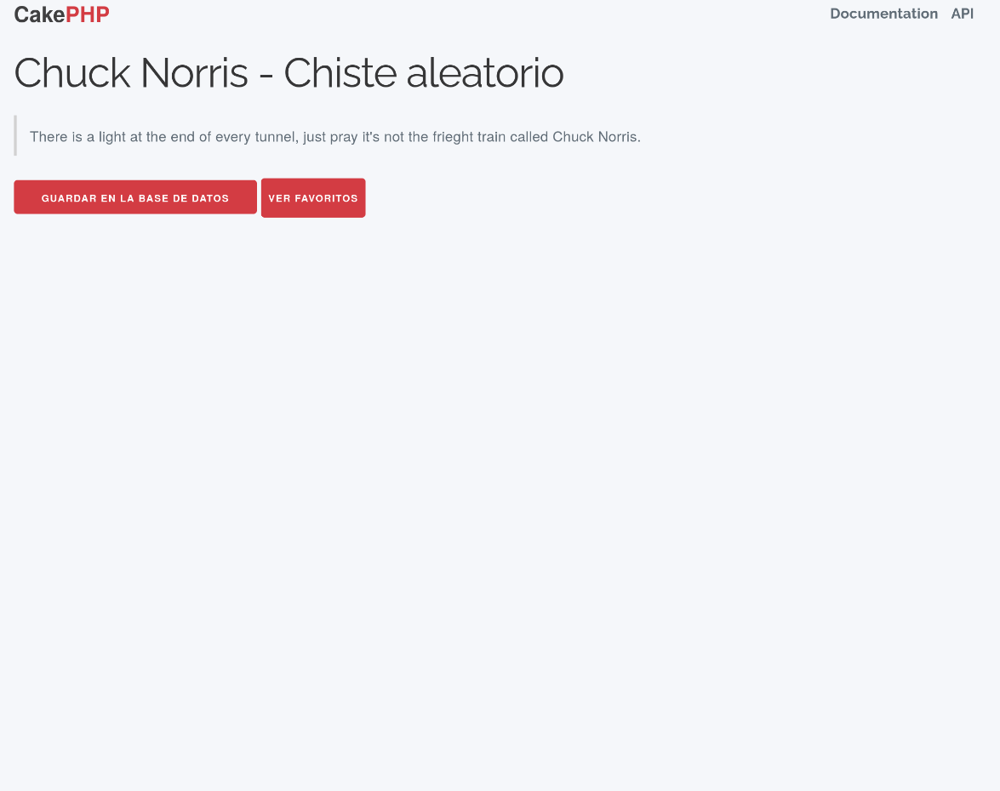

### 1. Instalación de dependencias

Para que la aplicación funcione correctamente en Fedora, es necesario instalar una serie de programas y librerías:

- ***PHP Built-in Server***: Es el encargado de recibir las peticiones de los usuarios y servir las páginas generadas por la aplicación.
  Sin un servidor web, el código PHP no podría ejecutarse ni ser accesible desde el navegador. Estamos utilizando el servidor de desarrollo integrado de PHP diñado específicamente para desarrollo local.
  En el proyecto, el servidor se ejecuta con:
  'php -S 0.0.0.0:8765 -t webroot'
  Donde:
    - php -S: Inicia el servidor web integrado de PHP
    - 0.0.0.0: Escucha en todas las interfaces de red
    - 8765: Puerto en el que se ejecuta
    - -t webroot: Especifica el directorio raíz del servidor (document root)

  

- ***PHP y extensiones***: PHP es el lenguaje en el que está desarrollada la aplicación. Las extensiones como php-mysqlnd, php-xml y php-mbstring
  permiten que CakePHP se comunique con la base de datos, procese archivos XML y maneje correctamente textos con caracteres especiales.
  Estas extensiones son fundamentales para evitar errores de ejecución.
  

  

- ***Base de datos*** (SqLite): Aquí se almacenan los datos que utiliza la aplicación, en este caso los chistes.
  

- ***Composer***: Es el gestor de dependencias de PHP. Composer descarga e instala automáticamente todas las librerías externas que necesita el proyecto,
  asegurando que todo esté en la versión correcta y funcionando en conjunto.
  

### 2. Clonación del repositorio y configuración

- ***Clonado***: Una vez que tenemos el entorno preparado, el siguiente paso lanzar un Fork del repositorio original de Maximo Fernández Riera
  [chuck-jokes ](https://github.com/maximofernandezriera/chuck-jokes.git)

  

- ***Configurar la base de datos***: Para que la aplicación sepa cómo conectarse a tu base de datos local. Aquí se define el usuario, la contraseña y el nombre de la base de datos.
  Este último aspecto es el que modificar en config/app_local.php, este archivo nos permite lanzar migraciones y crear la tabla de chistes.

  

- ***Migraciones***: Son scripts que crean y actualizan la estructura de la base de datos. Ejecutando las migraciones, se crean las tablas necesarias para que la aplicación funcione correctamente.

  

### 3. Ejecución de la aplicación

Con todo instalado y configurado, es momento de poner en marcha la aplicación:

- ***Iniciar el servidor de desarrollo***: ver descripción en el punto 1.

  

- ***Acceso desde el navegador:*** Una vez iniciado el servidor, podemos abrir la aplicación en el navegador usando la dirección local (http://localhost:8765).

### 4. Verificación

### 5. Boton "Ver chistes":

- src/Controller/JokesController.php: Se añadio la acción que obtiene los chistes de la base de datos, prepara los datos para la vista.
- templates/Jokes/index.php: Aquí se muestra la lista de chistes y el botón para visualizarlos.
- config/routes.php: Define la ruta para acceder a la acción del controlador (por ejemplo, /jokes).

  

  

